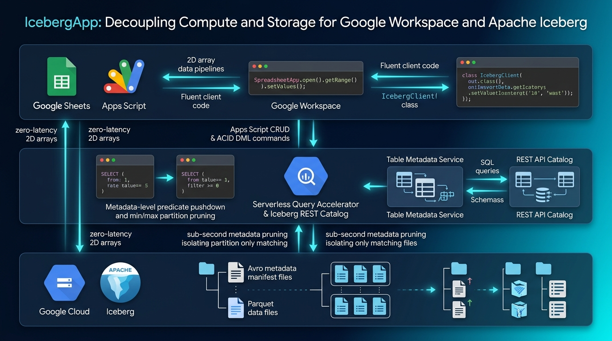

# IcebergApp

<a name="top"></a>
[](LICENSE)

<p align="center">
  <b>Turn Google Sheets into a Petabyte Lakehouse with Sub-Second ACID Queries.</b><br>
  <sub>A Google Apps Script library for managing Google Cloud Lakehouse for Apache Iceberg.</sub>
</p>

---

## Overview

**IcebergApp** is a high-performance Google Apps Script (GAS) library designed to manage and orchestrate [Apache Iceberg](https://iceberg.apache.org/) tables backed by Google Cloud Lakehouse (BigQuery and Google Cloud Storage).

By decoupling storage from compute, Google Cloud's Lakehouse architecture enables serverless, unified data lakehouse management. **IcebergApp** bridges this enterprise analytical ecosystem with Google Workspace:

- **Serverless Lakehouse Orchestration**: Manage Iceberg tables, schemas, and partition policies directly from Google Apps Script.
- **ACID Transactions & Predicate Pushdown**: Execute high-throughput DDL, DML (`INSERT`, `UPDATE`, `DELETE`), and filter queries that leverage Iceberg's metadata pruning.
- **Workspace Interoperability**: Seamless bidirectional data pipelines between Google Sheets (2D arrays) and petabyte-scale Iceberg tables without operational latency.
- **Overcoming Google Sheets Limits & CRUD Latency**: Permanently bypasses Google Sheets' 10-million cell limit and eliminates crippling latency in row searching, appending, in-place updating, and `deleteRow()` operations by offloading massive data mutations to serverless Parquet storage.
- **Time Travel Queries**: Query historical snapshots using Iceberg's native snapshot isolation.
- **Democratizing Apache Iceberg**: Eliminates the need for Java, Scala, Python (PyIceberg), or dedicated Spark clusters—enabling Workspace developers to orchestrate enterprise lakehouses using pure, fluent JavaScript.
- **Open Multi-Engine Federation (Zero Vendor Lock-In)**: Data committed to Cloud Storage resides as open Apache Parquet files, concurrently accessible by Apache Spark, Trino, Snowflake, and BigQuery.
- **Multimodal Binary & AI Vector Embeddings**: Native support for binary `Blob` ingestion into BigQuery `BYTES` (via `FROM_BASE64`) and automated Gemini vector embedding generation (`IcebergApp.generateEmbedding()`, `table.insertValuesWithEmbedding()`) when `GEMINI_API_KEY` is configured in Script/UserProperties.
- **High-Capacity Multipart Binary Upload (up to 50MB)**: Native integration of Kanshi Tanaike's multipart/form-data upload architecture for Google Apps Script, enabling direct uploads of large files (up to 50MB) to Google Drive and Cloud Storage, completely bypassing BigQuery's 1MB SQL query text limit.
- **Autonomous Catalog Provisioning & Dynamic Schema Adaptation**: `ensureCatalog()` automatically verifies and provisions missing BigQuery catalog datasets. Ingestion methods dynamically inspect table schema, mapping matching columns and bundling arbitrary custom metadata into JSON strings without SQL column-mismatch errors.
- **Interruption-Tolerant Zero-Residue Lifecycle Engine**: Dual-layer persistent resource registry (`ScriptProperties`), pre-flight sweeping, and `finally` blocks guarantee 100% complete cleanup of all ephemeral tables, datasets, buckets, and files—even when executions are interrupted, timed out, or aborted midway.

> **Published Technical Articles (Dev.to)**:  
> 1. [Unifying Google Workspace and Apache Iceberg: Serverless Lakehouse Management](https://dev.to/gde/unifying-google-workspace-and-apache-iceberg-serverless-lakehouse-management-ep3)
> 2. [Serverless Multimodal Vector Search on Apache Iceberg via Google Apps Script](https://dev.to/gde/serverless-multimodal-vector-search-on-apache-iceberg-via-google-apps-script-4fg)

---

## Architecture & Mechanics



IcebergApp uses the **BigQuery Advanced Service** as an accelerated query engine that interacts with the **Lakehouse Runtime Catalog (Iceberg REST Catalog)**. Metadata-level pruning (Min/Max statistics and partition manifest checks) occurs prior to scanning actual Parquet data files on Cloud Storage, significantly reducing scanned bytes and execution time within Google Apps Script runtime constraints.

```
[ Google Apps Script (IcebergApp) ]
                │
                ▼ (DML / DDL via BigQuery API)
[ BigQuery Lakehouse Engine / REST Catalog ]
                │
        (Metadata Pruning)
                │
                ▼
[ Cloud Storage (gs://bucket/) - Iceberg Parquet & Avro Metadata ]
```

---

## Overcoming Google Sheets Limitations: Why IcebergApp?

Google Sheets is the most intuitive and widely used frontline data interface. However, when used as an analytical data store or high-volume operational backend, developers invariably run into severe architectural limits:

| Operation | Google Sheets / GAS Bottlenecks | IcebergApp Solution |
| :--- | :--- | :--- |
| **Capacity** | **10-Million Cell Ceiling**: File bloat, slow loads, quota failures. | **Infinite Petabyte Lakehouse**: Parquet data stored on durable Cloud Storage. |
| **Search / Query** | **V8 Memory Overload & 6-Min Timeout**: Pulling massive ranges via `getValues()` to loop in V8 exhausts RAM and triggers timeouts. | **Predicate Pushdown (1–2s)**: Metadata Min/Max evaluation skips irrelevant files; returns only filtered rows. |
| **Insert / Append** | **Formula Recalculation Freeze**: Batch `appendRow()` / `setValues()` forces full workbook formula and revision recalculations. | **Atomic Parquet Streaming**: Direct micro-batch streaming via `table.insertValues()` with $O(1)$ client cost. |
| **Update (In-Place)**| **Full-Grid Rewrites**: Searching rows in memory and overwriting ranges causes severe RPC latency. | **Distributed SQL DML**: In-place `table.update(...)` executed directly on storage without cell-by-cell iteration. |
| **Delete (Rows)** | **Fatal `deleteRow()` Loop**: Deleting rows shifts the entire grid upward per call, freezing scripts or timing out. | **Metadata-Level Atomic Delete**: `table.deleteRows(...)` purges records instantaneously via metadata commits. |

By maintaining Google Sheets as an agile, lightweight presentation surface and delegating storage and heavy compute to Apache Iceberg and BigQuery, IcebergApp completely eliminates these performance barriers.

---

## Setup & Requirements

To use this library, you must link your Google Apps Script project to a standard Google Cloud Platform (GCP) project and enable the required APIs.

### 1. Create or Configure GCP Project

1. Open the [Google Cloud Console](https://console.cloud.google.com/).
2. Create a new project or select an existing project (e.g., `your-gcp-project-id`).
3. Note your **Project Number** and **Project ID** from the Project Dashboard.
4. Enable the following APIs in **APIs & Services > Library**:
   - **BigQuery API**
   - **Google Cloud Storage JSON API**

### 2. Link GCP Project to Google Apps Script

1. Open your Google Apps Script project.
2. Click **Project Settings** (gear icon) in the left sidebar.
3. Under **Google Cloud Platform (GCP) Project**, click **Change project**.
4. Enter your **GCP Project Number** and confirm.

### 3. Enable BigQuery Advanced Service

1. In the Apps Script editor, click the **+** icon next to **Services**.
2. Select **BigQuery API**.
3. Choose version `v2` and keep the identifier as `BigQuery`.
4. Click **Add**.

### 4. Configure Manifest (`appsscript.json`)

Enable the manifest editor by checking **Show "appsscript.json" manifest file in editor** under **Project Settings**. Update your `appsscript.json` with the required configuration.

#### Standard Consumer Profile
```json
{
  "timeZone": "Asia/Tokyo",
  "dependencies": {
    "enabledAdvancedServices": [
      {
        "userSymbol": "BigQuery",
        "serviceId": "bigquery",
        "version": "v2"
      }
    ]
  },
  "exceptionLogging": "STACKDRIVER",
  "runtimeVersion": "V8",
  "oauthScopes": [
    "https://www.googleapis.com/auth/bigquery",
    "https://www.googleapis.com/auth/spreadsheets"
  ]
}
```

#### Test Suite & Sample Scenarios Runner Profile (`src/test.js`, `src/samples.js`)
When running the automated lifecycle test suite (`src/test.js`) or sample scenarios (`src/samples.js`), additional OAuth scopes are required:
- `https://www.googleapis.com/auth/documents`: **Required for creating and exporting Google Documents** in `runAllSamples()` / `sample1_importGoogleDocToIceberg_()` and Test Step 10.
- `https://www.googleapis.com/auth/drive`: Required for Google Drive File/Folder traversal and lifecycle cleanup.
- `https://www.googleapis.com/auth/devstorage.full_control`: Required for autonomous GCS Bucket provisioning and purge.
- `https://www.googleapis.com/auth/script.external_request`: Required for `UrlFetchApp` (external asset downloads and Gemini Embedding API calls).

```json
{
  "timeZone": "Asia/Tokyo",
  "dependencies": {
    "enabledAdvancedServices": [
      {
        "userSymbol": "BigQuery",
        "serviceId": "bigquery",
        "version": "v2"
      }
    ]
  },
  "exceptionLogging": "STACKDRIVER",
  "runtimeVersion": "V8",
  "oauthScopes": [
    "https://www.googleapis.com/auth/bigquery",
    "https://www.googleapis.com/auth/spreadsheets",
    "https://www.googleapis.com/auth/documents",
    "https://www.googleapis.com/auth/drive",
    "https://www.googleapis.com/auth/devstorage.full_control",
    "https://www.googleapis.com/auth/script.external_request"
  ]
}
```

---

## Installation

You can install IcebergApp using either of the following methods:

1. **Direct Inclusion**: Copy the contents of `src/IcebergApp.js` directly into your Google Apps Script project.
2. **As a Library**: Add the script ID as a library with the identifier `IcebergApp`.

> [!NOTE]
> Both `IcebergApp.openByCatalog(...)` and global `openByCatalog(...)` are fully supported in all environments.

---

## Methods

### `IcebergApp`

| Method | Return | Description |
| :--- | :--- | :--- |
| `openByCatalog(projectId, catalogName, location)` | `IcebergApp` | Initializes the IcebergApp instance for a specific catalog/dataset. |
| `create(tableName, options)` | `IcebergTable` | Creates a new Apache Iceberg / BigLake table. |
| `createAssetTable(tableName, options)` | `IcebergTable` | Creates an asset table pre-configured for binary Blobs and Drive files (`id`, `file_id`, `name`, `mime_type`, `size`, `data`, `embedding`, `updated_at`). |
| `getTables()` | `Array<IcebergTable>` | Lists all tables within the catalog. |
| `getTableByName(tableName)` | `IcebergTable \| null` | Retrieves an IcebergTable instance by name from `INFORMATION_SCHEMA`. |
| `getTable(tableName)` | `IcebergTable` | Directly returns an IcebergTable instance without querying `INFORMATION_SCHEMA`. |

### `IcebergTable`

| Method | Return | Description |
| :--- | :--- | :--- |
| `getName()` | `string` | Returns the table name. |
| `getFullPath()` | `string` | Returns the fully qualified table path for SQL statements. |
| `asOf(timestamp)` | `IcebergTable` | Sets snapshot time for Time Travel queries (method chaining). |
| `resetSnapshot()` | `IcebergTable` | Clears Time Travel snapshot constraints. |
| `getValues(filter)` | `Array<Array<any>>` | Queries rows matching conditions and returns a 2D array (headers included). Supports `{ columns, where, orderBy, limit }`. |
| `insertValues(values)` | `number` | Inserts a 2D array of values (first row as column headers). |
| `insertBlob(blob, metadata, options)` | `number` | Inserts a single Google Apps Script binary `Blob` with metadata and optional Gemini embedding. |
| `insertBlobs(blobEntries, options)` | `number` | Batch inserts multiple `Blob` objects in a single atomic query. |
| `insertDriveFile(fileId, metadata, options)` | `Object` | Ingests a Google Drive file by ID. Preserves `file_id`. Supports automatic PDF conversion (default) or custom `targetMimeType`. |
| `insertDriveFolder(folderId, options)` | `Object` | Recursively collects all files from a Google Drive folder and batch-inserts them into the Iceberg table. |
| `searchSimilar(query, options)` | `Array<Array<any>>` | Performs vector similarity search using Gemini Embeddings and BigQuery `COSINE_DISTANCE`. |
| `update(setClause, whereClause)` | `string` | Performs an atomic DML update on matching rows. |
| `deleteRows(whereClause)` | `string` | Deletes rows satisfying the specified predicate. |
| `exportToSheet(sheet, startA1, filter)` | `number` | Directly exports query results into a target Google Spreadsheet sheet. Supports `{ columns, where, orderBy, limit }`. |
| `remove(ifExists)` | `string` | Drops the table entity from the catalog. |

---

## Usage Examples

### 1. Initialize and Create an Iceberg Table

```javascript
const PROJECT_ID = "your-gcp-project-id";
const CATALOG_NAME = "lakehouse_catalog";
const REGION = "asia-northeast1"; // Crucial: Align BigQuery and GCS region

const app = IcebergApp.openByCatalog(PROJECT_ID, CATALOG_NAME, REGION);

const schema = [
  { name: "id", type: "INT64", mode: "REQUIRED" },
  { name: "product", type: "STRING" },
  { name: "price", type: "FLOAT64" },
  { name: "stock", type: "INT64" },
  { name: "created_at", type: "TIMESTAMP" },
];

const table = app.create("SensorsTable", {
  schema: schema,
  storageUri: "gs://your-lakehouse-bucket/tables/SensorsTable",
  partitionBy: ["DATE(created_at)"],
  clusterBy: ["id"],
});
```

### 2. Insert 2D Array Values (Google Sheets Compatible)

```javascript
const records = [
  ["id", "product", "price", "stock", "created_at"],
  [101, "Quantum Sensor Alpha", 1500.0, 10, new Date()],
  [102, "Superconducting Coil", 3200.5, 5, new Date()],
  [103, "Optical Waveguide", 450.0, 42, new Date()],
];

const inserted = table.insertValues(records);
console.log(`Inserted ${inserted} rows.`);
```

### 3. Query with Predicate Pushdown

```javascript
// Iceberg metadata prunes non-matching files prior to scanning
const filtered = table.getValues({
  columns: ["id", "product", "price"],
  where: "price > 1000.0",
  orderBy: "id ASC", // Optional ORDER BY clause
});

console.log(filtered);
// Output: [["id", "product", "price"], ["101", "Quantum Sensor Alpha", "1500.0"], ["102", "Superconducting Coil", "3200.5"]]
```

### 4. Direct Export to Google Sheets

```javascript
const ss = SpreadsheetApp.create("Iceberg_Metrics_Export");
const sheet = ss.getSheets()[0];

table.exportToSheet(sheet, "A1", {
  where: "stock > 0",
  orderBy: "id ASC",
});

console.log(`Exported to: ${ss.getUrl()}`);
```

### 5. In-Place Mutation and Deletion (ACID DML)

```javascript
// Atomic DML update
const updateRes = table.update("stock = stock - 2", "id = 101");
console.log(updateRes);

// Atomic predicate-based deletion
const delRes = table.deleteRows("stock <= 0");
console.log(delRes);
```

### 6. Snapshot Isolation / Time Travel

```javascript
// Query the state of the table as it existed 10 minutes ago
const pastTime = new Date(Date.now() - 10 * 60 * 1000);
const pastValues = table.asOf(pastTime).getValues({ where: "id = 101" });

console.log(pastValues);
```

### 7. Google Drive & Multimodal Binary Asset Ingestion

IcebergApp provides first-class support for storing, indexing, and vectorizing binary files (images, PDFs, documents) with rich metadata alongside tabular records:

- **Google Workspace Document Normalization (Default: PDF Export)**: Google Docs, Sheets, and Slides (`application/vnd.google-apps.*`) are proprietary cloud structures rather than raw byte streams. When ingested via `insertDriveFile()`, `IcebergApp` automatically normalizes them to high-fidelity PDF (`application/pdf`) via `getBlob()`.
- **Post-Conversion MIME Verification & Extension Harmonization**: `IcebergApp` explicitly inspects the converted Blob's MIME type via `blob.getContentType()`, confirming the actual storage MIME type and ensuring filename extensions (`.pdf`, `.txt`) accurately match the underlying data.
- **Dual MIME Type Tracking**: Asset tables preserve both `source_mime_type` (the original Google Cloud format, e.g. `application/vnd.google-apps.document`) and `mime_type` (the verified storage format, e.g. `application/pdf`), providing complete auditability.
- **Native Plain Text Export via DocumentApp**: Bypasses GAS's native `file.getAs('text/plain')` limitation on Google Docs by seamlessly extracting text via `DocumentApp.openById().getBody().getText()`, creating clean, structured `text/plain` assets with `.txt` extensions upon request.
- **Adaptive Description-Based Vector Embeddings**: For binary Blobs (such as images), `IcebergApp` automatically leverages descriptive metadata (`description`, `caption`, `summary`, or `name`) to generate meaningful Gemini vector embeddings without triggering empty-text API errors.

```javascript
// 1. Create a dedicated asset table
const assetTable = app.createAssetTable("lakehouse_assets");

// 2. Ingest Google Drive File by File ID (Default: auto-converts Docs/Sheets/Slides to PDF)
// Preserves `file_id` for downstream 1-click navigation back to Drive
assetTable.insertDriveFile("DRIVE_FILE_ID", {
  category: "technical_specs",
  author: "Kanshi Tanaike",
});

// 3. Ingest Google Drive File with custom MIME conversion (e.g. Doc -> text/plain via DocumentApp)
assetTable.insertDriveFile("DRIVE_FILE_ID", { category: "raw_text" }, {
  targetMimeType: "text/plain",
});

// 4. Ingest entire Google Drive Folder recursively
assetTable.insertDriveFolder("DRIVE_FOLDER_ID", {
  recursive: true,
  metadata: { ingestion_batch: "2026-Q3-ARCHIVE" },
});

// 5. Direct Blob Ingestion (e.g. downloaded from URL)
const res = UrlFetchApp.fetch("https://example.com/sample_image.png");
const blob = res.getBlob().setName("sample_image.png");
// Automatically computes Gemini multimodal embedding from description or text if GEMINI_API_KEY is configured
assetTable.insertBlob(blob, {
  source: "external_web",
  description: "High-resolution architectural diagram of the Lakehouse system",
});

// 6. Natural Language Vector Similarity Search (using GEMINI_API_KEY & COSINE_DISTANCE)
const matches = assetTable.searchSimilar("How to build serverless lakehouses with Apps Script?", {
  topK: 5,
  columns: ["id", "file_id", "name", "mime_type"]
});
console.log(matches);
// Returns 2D array including distance and similarity columns, ranked by semantic relevance
```

### 8. High-Capacity Binary Multipart Upload (up to 50MB)

For large binary assets (high-resolution images, multi-page PDFs, audio, archives up to **50MB**), `IcebergApp` incorporates Kanshi Tanaike's [multipart/form-data upload architecture](https://gist.githubusercontent.com/tanaikech/5cd0dc9ea7d75e4a2ff65049ed3d78c3/raw/13b25563d38f9e8809bff7d5835dd727d91a968a/submit.md) for Google Apps Script, bypassing BigQuery's 1MB SQL query text limitation:

- **Size Integrity Preservation**: When assets are uploaded via `uploadAsset()`, the exact byte size (e.g. 50MB) is guaranteed to be recorded in the Iceberg table's `size` column, while setting the BigQuery `data` column to `NULL` to prevent duplicate storage costs.
- **Drive API v3 Metadata Sanitization**: Custom attributes (e.g. `category`, `upload_type`) are safely nested into Drive's `properties` map, preventing HTTP 400 Bad Request errors from Google Drive API.
- **Smart Storage URI Routing**: Automatically redirects large binary Blobs (> 700KB) from `insertBlob()` to multipart upload when a storage URI is configured.

```javascript
// 1. Upload directly to Google Drive via Drive API v3 multipart/form-data and register in Iceberg
const largePdfBlob = DriveApp.getFileById("LARGE_DOC_ID").getBlob();
const driveUploadRes = assetTable.uploadAsset(largePdfBlob, {
  category: "enterprise_archives",
  confidentiality: "internal",
}, { destination: "drive" });

console.log(`Uploaded to Drive: ${driveUploadRes.uri} (File ID: ${driveUploadRes.fileId}, Size: ${driveUploadRes.size} bytes)`);

// 2. Upload directly to Cloud Storage (GCS) and link with Iceberg Lakehouse
const gcsUploadRes = assetTable.uploadAsset(largePdfBlob, {
  category: "lakehouse_raw_media",
}, {
  destination: "storage",
  storageUri: "gs://your-bucket-name/iceberg_assets"
});

console.log(`Uploaded to GCS: ${gcsUploadRes.uri}`);

// 3. Standalone utility helpers
const driveFile = IcebergApp.uploadToDrive(largePdfBlob, { description: "Archived report" });
const gcsObject = IcebergApp.uploadToStorage(largePdfBlob, "your-bucket-name", "reports/q3_report.pdf");
```

### 9. Agentic AI Integration via Model Context Protocol (MCP) & [GASADK](https://github.com/tanaikech/adk-gas)

IcebergApp can be effortlessly exposed as deterministic MCP tools hosted directly inside Google Apps Script using **[GASADK (Agent Development Kit for Google Apps Script)](https://github.com/tanaikech/adk-gas)**:

- **Autonomous Tool Calling**: AI foundation models such as **Google Gemini** can dynamically discover and invoke IcebergApp methods (`getValues`, `insertValues`, `update`, `deleteRows`, `asOf`) via standard MCP RPC.
- **Natural Language to Optimized Lakehouse DML**: Business users interact with Gemini in natural language (e.g., *"Analyze sales anomalies across our IoT sensor metrics and adjust flagged calibration offsets"*). Gemini formulates queries, pushes down metadata filters through IcebergApp, and executes ACID DML updates without manual SQL intervention.
- **Closed-Loop Workspace Automation**: Autonomous agents can simultaneously update the Iceberg lakehouse, append audit records into Google Sheets, send Gmail notifications, and generate formatted executive briefs in Google Docs.

---

## Sample Scenarios & Automation (`src/samples.js`)

[`src/samples.js`](src/samples.js) provides production-ready scenarios demonstrating multimodal binary data integration, Google Drive synchronization, Gemini AI vector similarity search, and high-capacity 50MB multipart uploads.

### Four End-to-End Scenarios

1. **Sample 1: Google Document Ingestion & Metadata Preservation (`sample1_importGoogleDocToIceberg_`)**
   - Creates a structured Google Document explaining Google Apps Script architecture.
   - Extracts plain text via `DocumentApp` and computes high-quality Gemini Embeddings.
   - Ingests into Apache Iceberg table both as default PDF export and custom plain text (`text/plain`).
   - Preserves Google Drive `file_id` in table metadata, enabling 1-click navigation back to Drive.

2. **Sample 2: External Image Blob Ingestion (`sample2_importExternalImageBlobToIceberg_`)**
   - Fetches an external architectural diagram image via `UrlFetchApp`.
   - Ingests raw binary Blob directly into Iceberg table with metadata.
   - Automatically generates multimodal vector embeddings with Gemini API.

3. **Sample 3: Multimodal Vector Similarity Search (`sample3_vectorSearchWithGeminiEmbedding_`)**
   - Ingests multi-domain knowledge articles (Cloud, Quantum Physics, Marine Biology) into an Iceberg table.
   - Generates 768-dimensional Gemini embeddings (`text-embedding-004`).
   - Performs natural language semantic search using BigQuery's native `COSINE_DISTANCE`, returning ranked results with cosine similarity scores.

4. **Sample 4: High-Capacity Multipart Upload (up to 50MB) (`sample4_multipartUploadToDriveAndIceberg_`)**
   - Implements Kanshi Tanaike's `multipart/form-data` upload architecture.
   - Uploads binary files up to **50MB** to Google Drive (or Cloud Storage) and registers them into Apache Iceberg without hitting BigQuery's 1MB query size limit.

### Execution & Lifecycle Management

Following Google Apps Script best practices, internal sub-samples are defined as private functions (with trailing `_`), exposing only clean public entry points in the editor:

- **`runAllSamples()`**: Primary public runner. Executes all 4 samples sequentially and automatically purges all created tables and documents in `finally`.
- **`purgeAllSampleCreatedResources()`**: Public standalone emergency cleanup function. Completely purges all sample tables, documents, and the BigQuery catalog dataset (`lakehouse_catalog`) in a single click.

```javascript
// Run all sample scenarios with automatic zero-residue cleanup:
runAllSamples();

// Or purge all sample resources including BigQuery dataset at any time:
purgeAllSampleCreatedResources();
```

> [!TIP]
> **Zero-Code Configuration via PropertiesService**:
> `runAllSamples()` (and `runIcebergAppTests()`) automatically checks `PropertiesService` (`ScriptProperties` / `UserProperties`) on startup. If `PROJECT_ID`, `REGION` (defaults to `asia-northeast1`), or `GEMINI_API_KEY` are configured in your script properties, they take priority automatically, eliminating the need to hardcode sensitive credentials in the source code.

---

## Verification & Test Execution

The automated test suite (`src/test.js`) operates in a **Pure Lifecycle Mode** with **Interruption-Tolerant Abort Safety**:

- **Real-Time Persistent Registry**: As resources are provisioned (BigQuery datasets, tables, GCS buckets, Google Docs, Spreadsheets, folders), their identifiers are immediately written to `ScriptProperties` (`_ICEBERG_ACTIVE_TEST_RESOURCES_`).
- **Pre-Flight Automatic Sweeping**: On startup, `runIcebergAppTests()` checks the registry and purges any residual artifacts left by previous aborted, timed-out, or cancelled runs before launching new tests.
- **`finally` Block Zero-Residue Guarantee**: Guarantees complete cleanup of all created assets upon normal completion or unhandled exceptions.
- **Multi-Layer Wildcard Sweeping**: Sweeps BigQuery for `lakehouse_test_*` datasets and Google Drive for `Iceberg_Test_*` / `GAS_Overview_*` artifacts.
- **Standalone Purge Utility**: `purgeResidualTestResources()` can be executed manually at any time to restore the workspace to a pristine state.

> [!NOTE]
> Ensure your `appsscript.json` is configured with the [Test Suite & Sample Scenarios Runner Profile](#test-suite--sample-scenarios-runner-profile-srctestjs-srcsamplesjs) containing all required OAuth scopes (`bigquery`, `spreadsheets`, `documents`, `drive`, `devstorage.full_control`, and `script.external_request`) before executing `runIcebergAppTests()` or running sample workflows.

```
00:00:00  Notice  Execution started
00:00:00  Info    🚀 Starting IcebergApp Automated Test Suite (Stage 3/4 Protocol 17 Compliance)
00:00:00  Info    --- STEP 0-A: Ensuring Isolated Dataset [lakehouse_test_[test-run-id]] ---
00:00:01  Info    ⚡ Dataset [lakehouse_test_[test-run-id]] absent. Provisioning at [asia-northeast1]...
00:00:03  Info    ✅ Dataset [lakehouse_test_[test-run-id]] created at [asia-northeast1].
00:00:03  Info    --- STEP 0-B: Ensuring Ephemeral Bucket [lakehouse-iceberg-test-[project-id]-[test-run-id]] ---
00:00:05  Info    ✅ Base Storage Ready: gs://lakehouse-iceberg-test-[project-id]-[test-run-id]
00:00:05  Info    --- STEP 1: Creating Apache Iceberg Table ---
00:00:06  Info    ✅ Table Created: Test_Iceberg_[test-run-id]
00:00:06  Info    --- STEP 2: Inserting 2D Array Values ---
00:00:07  Info    ✅ Inserted 3 records.
00:00:07  Info    --- STEP 3: Querying with Predicate Pushdown ---
00:00:08  Info    ✅ Predicate pushdown assertions passed: [["id","product","price"],["101","Quantum Sensor Alpha","1500.0"],["102","Superconducting Coil","3200.5"]]
00:00:08  Info    --- STEP 4: Verifying Snapshot Isolation (asOf) ---
00:00:12  Info    --- STEP 5: DML Update ---
00:00:14  Info    ✅ Table Test_Iceberg_[test-run-id] successfully updated.
00:00:15  Info    --- STEP 5-B: Executing Time Travel Query ---
00:00:15  Info    ✅ Time travel snapshot verified successfully.
00:00:15  Info    --- STEP 6: DML Delete ---
00:00:17  Info    ✅ Rows deleted matching (id = 103).
00:00:18  Info    ✅ DML Delete verified.
00:00:18  Info    --- STEP 7: Exporting to Spreadsheet ---
00:00:20  Info    ✅ Exported to Spreadsheet: https://docs.google.com/spreadsheets/d/[spreadsheet-id]/edit
00:00:20  Info    🎉 ALL TESTS & PROTOCOL 17 ASSERTIONS PASSED CLEANLY.
00:00:20  Info    --- ABSOLUTE CLEANUP: Purging ephemeral test resources ---
00:00:20  Info    🗑️ Dropped Iceberg table: Test_Iceberg_[test-run-id]
00:00:21  Info    🗑️ Trashed temporary Spreadsheet: [spreadsheet-id]
00:00:22  Info    🗑️ Removed Ephemeral BigQuery Dataset: [lakehouse_test_[test-run-id]]
00:00:24  Info    🗑️ Deleted Ephemeral GCS Bucket: gs://lakehouse-iceberg-test-[project-id]-[test-run-id]
00:00:24  Info    ✨ CLEANUP COMPLETED: Workspace restored to pure state.
00:00:25  Notice  Execution completed
```

---

## Update History

- **v1.2.0 (September 8, 2026)**
  - **High-Capacity Binary Multipart Upload (up to 50MB)**: Added `IcebergApp.uploadToDrive()`, `IcebergApp.uploadToStorage()`, and `IcebergTable.prototype.uploadAsset()` using Kanshi Tanaike's zero-dependency `multipart/form-data` upload architecture with `UrlFetchApp.fetch`, overcoming BigQuery's 1MB SQL query length limit.
  - **Size Integrity & BigQuery Storage Optimization**: Preserves exact uploaded byte size in the Iceberg table's `size` column while setting BigQuery's inline `data` (`BYTES`) column to `NULL` when external storage (Drive/GCS) is used, preventing duplicate storage costs and query bloat.
  - **Google Workspace Document Normalization (Default PDF Export)**: Ingestion of Google Docs, Sheets, and Slides (`application/vnd.google-apps.*`) natively converts them to standard `application/pdf` via `getBlob()`, ensuring format fidelity and universal portability.
  - **MIME Verification & Extension Harmonization**: Explicitly verifies the post-conversion MIME type via `blob.getContentType()`, synchronizes file extensions (`.pdf`, `.txt`), and tracks both `source_mime_type` (original Google Cloud format) and `mime_type` (storage format).
  - **Native DocumentApp Plain Text Export**: Enables direct plain text extraction (`text/plain`) for Google Documents via `DocumentApp.openById().getBody().getText()`, gracefully bypassing GAS `file.getAs('text/plain')` limitations.
  - **Safe Clustering Column Filtering**: `IcebergApp.create()` automatically validates and filters `clusterBy` columns against the actual table schema, preventing BigQuery `Unrecognized name` errors on custom schemas.
  - **Zero-Code Configuration via PropertiesService**: Both `src/samples.js` and `src/test.js` automatically discover and prioritize `PROJECT_ID`, `REGION` (default: `asia-northeast1`), and `GEMINI_API_KEY` from `ScriptProperties` or `UserProperties`, eliminating code-level modifications.
  - **Smart Storage URI Routing**: Added `table.setStorageUri()` and `table.getStorageUri()`. `table.insertBlob()` automatically redirects binaries > 700KB to multipart upload when a storage URI is configured.
  - **Autonomous BigQuery Catalog Dataset Provisioning**: `ensureCatalog()`, `create()`, and `_runQuery()` autonomously detect missing BigQuery datasets and provision them on the fly in the configured location, eliminating `Dataset not found` errors.
  - **Schema-Adaptive Dynamic Column Filtering**: Added `table.getColumnNames()`. `table.insertBlobs()` dynamically inspects destination table columns, filtering payload keys to exact matching columns and safely serializing extraneous metadata into a `metadata` JSON column.
  - **Adaptive Multimodal Gemini Vector Embeddings**: Enhanced `table.insertBlobsWithEmbedding()` to extract document text via `DocumentApp` for Google Docs, utilize metadata descriptions for image embeddings, and gracefully bypass non-text blobs without throwing HTTP 400 errors.
  - **Interruption-Tolerant Persistent Lifecycle Engine**: Added dual-layer `ScriptProperties` tracking (`_ICEBERG_ACTIVE_TEST_RESOURCES_` and `_ICEBERG_ACTIVE_SAMPLE_RESOURCES_`) in both `src/test.js` and `src/samples.js`. Features pre-flight resource sweeping, robust `finally` cleanup, and standalone purgers (`purgeResidualTestResources()` and `purgeAllSampleCreatedResources()`) capable of recovering and removing orphaned Google Docs, BigQuery tables, datasets, and Cloud Storage buckets even after script timeout or manual cancellation.
  - **Comprehensive Production Sample Suite (`src/samples.js`)**: Implemented 4 real-world lakehouse integration scenarios executable via `runAllSamples()`, complying with Google Apps Script private function conventions (`{name}_` with trailing underscore) to maintain a pristine GAS IDE execution menu.

- **v1.1.0 (September 7, 2026)**
  - Added `filter.orderBy` parameter to `IcebergApp.getValues()` and `IcebergApp.exportToSheet()`.
  - Added automatic BigQuery raw epoch second float conversion to standard ISO 8601 strings in `IcebergApp`.
  - Added native binary `Blob` ingestion (`BYTES` via `FROM_BASE64`) and `ARRAY` literal handling in `insertValues`.
  - Added automated Gemini Vector Embedding integration (`IcebergApp.generateEmbedding()`, `table.insertValuesWithEmbedding()`) with optional `GEMINI_API_KEY` resolution.

- **v1.0.0 (September 6, 2026)**
  - Initial release of `IcebergApp`.
  - Support for Lakehouse for Apache Iceberg table management via BigQuery Advanced Service.
  - Native 2D array integration for Google Sheets (`insertValues`, `getValues`, `exportToSheet`).
  - Support for Predicate Pushdown, ACID DML operations (`UPDATE`, `DELETE`), and Snapshot Time Travel (`asOf`).
  - Pure Lifecycle Test Suite with zero-residue autonomous provisioning and cleanup.
  - Full pagination handling, Stage 3 extreme numerical vector resilience, and auto-expanding spreadsheet boundaries.
  - Seamless Model Context Protocol (MCP) tool interoperability via [GASADK](https://github.com/tanaikech/adk-gas) for autonomous AI agent workflows.

---

## Licence

[MIT](LICENSE)

## Author

[Kanshi Tanaike](https://tanaikech.github.io/)

[Donate](https://tanaikech.github.io/donate/)
