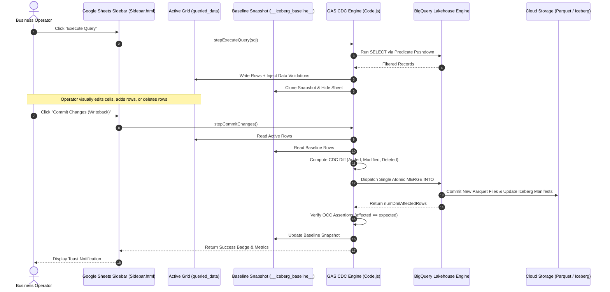

# Apache Iceberg End-User Writeback UI via Google Sheets
## Interactive Bidirectional Synchronization between Google Workspace and Serverless Lakehouse

[](../../LICENSE)

---

## 1. System Overview & Architecture

> **Prerequisite Reading (Published Article on Dev.to)**:  
> [Unifying Google Workspace and Apache Iceberg: Serverless Lakehouse Management](https://dev.to/gde/unifying-google-workspace-and-apache-iceberg-serverless-lakehouse-management-ep3)

**Apache Iceberg Writeback UI** transforms Google Sheets from a conventional spreadsheet into a high-performance, interactive writeback console for Google Cloud Lakehouse (Apache Iceberg and BigQuery).

While enterprise tools such as Google Connected Sheets offer petabyte-scale read access, they remain strictly **unidirectional (Read-Only)**. If an operator updates product pricing, corrects master data, or deletes invalid records in the spreadsheet, there is no native path to persist those changes back to the lakehouse. Commercial Reverse ETL tools (e.g., Census, Hightouch) introduce high subscription costs, compliance concerns, and third-party SaaS data egress.

This application provides a **100% serverless, zero-maintenance, bidirectional bridge**:
- **Differential Change Data Capture (CDC)**: Accurately identifies `ADDED`, `MODIFIED`, and `DELETED` rows by comparing active spreadsheet edits against a protected immutable baseline snapshot (`__iceberg_baseline__`).
- **Atomic Single-Query `MERGE INTO` Writeback**: Synthesizes a unified BigQuery `MERGE INTO` query with explicit column type casting and optimistic concurrency checks, executing in sub-seconds and eliminating manifest file fragmentation.
- **Optimistic Concurrency Control (OCC) with Microsecond Discrepancy Tolerance**: Validates `updated_at` timestamps using second-level delta assertions (`TIMESTAMP_DIFF(T.updated_at, S._orig_updated_at, SECOND) = 0`) to seamlessly bridge the microsecond-precision gap between BigQuery ($10^{-6}$s) and Google Sheets ($10^{-3}$s) while strictly intercepting concurrent background ETL overwrites.
- **100,000-Cell Safeguard**: Pre-computes cell count (`total_rows * total_columns`) before full table exports to protect browser responsiveness and prevent spreadsheet locks.
- **Privacy Mode for Video Recording & Public Demos**: One-click DOM masking toggle (`[🛡️ Privacy: OFF]` ⇄ `[🔒 Privacy: ON]`) that masks GCP Project IDs, Dataset IDs, Bucket URIs, and SQL queries with bullet masking (`••••••••••••`), enabling live screencasts without leaking sensitive credentials.
- **Deterministic Primary Key Sorting**: Table queries and post-commit full inspections are deterministically sorted by primary key (`ORDER BY id ASC`), ensuring consistent visual verification across spreadsheet sheets.
- **Dual Verification Modes**: Interactive step-by-step Google Sheets UI console with dynamic step badges and inline results, alongside an autonomous zero-residue headless test suite (`HeadlessTest.js`).

### Architecture Workflow



---

## 2. Prerequisites & Google Cloud Setup

### 2.1 Google Cloud Platform (GCP) Project Requirements
1. **Google Cloud Project**: You must have an active GCP project with billing enabled.
2. **Enabled APIs**:
   - **BigQuery API** (`bigquery.googleapis.com`)
   - **Google Cloud Storage JSON API** (`storage.googleapis.com`)
3. **IAM Permissions**:
   - The Google account executing the script must possess:
     - `BigQuery Admin` (or `BigQuery Data Editor` + `BigQuery Job User`)
     - `Storage Admin` (or `Storage Object Admin` on target bucket)

### 2.2 Google Apps Script Manifest Configuration (`appsscript.json`)
Ensure the following settings and OAuth scopes are enabled in your project's `appsscript.json`:

```json
{
  "timeZone": "Asia/Tokyo",
  "dependencies": {
    "enabledAdvancedServices": [
      {
        "userSymbol": "BigQuery",
        "serviceId": "bigquery",
        "version": "v2"
      }
    ]
  },
  "exceptionLogging": "STACKDRIVER",
  "runtimeVersion": "V8",
  "oauthScopes": [
    "https://www.googleapis.com/auth/bigquery",
    "https://www.googleapis.com/auth/spreadsheets",
    "https://www.googleapis.com/auth/drive",
    "https://www.googleapis.com/auth/devstorage.read_write",
    "https://www.googleapis.com/auth/script.external_request",
    "https://www.googleapis.com/auth/script.container.ui"
  ]
}
```

---

## 3. Deployment as a Container-Bound Script

1. **Create a Google Spreadsheet**:
   - Navigate to [sheets.new](https://sheets.new) to create a new spreadsheet.
   - Name the spreadsheet (e.g., `Iceberg Lakehouse Console`).
2. **Open Apps Script Editor**:
   - In Google Sheets menu, click **Extensions > Apps Script**.
3. **Add Manifest**:
   - Click **Project Settings** (gear icon) > Check **Show "appsscript.json" manifest file in editor**.
   - Open `appsscript.json` and replace with the configuration above.
4. **Enable BigQuery Service**:
   - In the left sidebar, click **Services (+)** > Select **BigQuery API** (`v2`) > Click **Add**.
5. **Add Code Files (Mandatory Prerequisite: Include `src/IcebergApp.js`)**:
   The writeback engine is strictly powered by the core `IcebergApp` library (`src/IcebergApp.js`). Add the files to your Apps Script project:
   - **File 1 (Core Engine - Mandatory)**: Click **+ > Script**, name the file `IcebergApp`, and paste the full contents of [`src/IcebergApp.js`](../../src/IcebergApp.js). *(Alternatively, link the `IcebergApp` script library).*
   - **File 2 (Application Backend)**: Replace default `Code.gs` with the contents of [`Code.js`](Code.js).
   - **File 3 (Sidebar Frontend)**: Click **+ > HTML**, name the file `Sidebar`, and paste the contents of [`Sidebar.html`](Sidebar.html).
   - **File 4 (Autonomous Test Suite)**: Click **+ > Script**, name the file `HeadlessTest`, and paste the contents of [`HeadlessTest.js`](HeadlessTest.js).
6. **Save Project**:
   - Click the Save icon (Ctrl+S or Cmd+S).
7. **Refresh Spreadsheet**:
   - Return to your spreadsheet tab and reload the page. The custom menu **Iceberg Lakehouse** will appear in the toolbar.

---

## 4. Primary Verification Step: Autonomous Headless Test Suite (`HeadlessTest.js`)

> [!IMPORTANT]
> **Run this test FIRST before opening the Google Sheets UI.**  
> Executing `runAutonomousWritebackHeadlessTest()` validates that your Google Cloud Project link, IAM roles, BigQuery Advanced Service, and the core `IcebergApp.js` (v1.2.0) engine are functioning properly without any UI or spreadsheet interference. Once this passes cleanly, you can proceed with 100% confidence to the interactive UI.

### 4.1 Persistent Lifecycle Registry & Interruption Resilience
To eliminate the risk of orphaned BigQuery datasets or Cloud Storage buckets when tests are manually cancelled, aborted, or reach Apps Script execution timeouts:
1. **Persistent Registry (`ScriptProperties`)**: Ephemeral datasets and buckets are tracked in `_ICEBERG_ACTIVE_HEADLESS_RESOURCES_` immediately upon creation.
2. **Pre-Flight Sweep**: Every execution of `runAutonomousWritebackHeadlessTest()` automatically scans the persistent registry and deletes any residual resources from previous aborted sessions before provisioning new ones.
3. **Emergency Manual Purge (`purgeResidualHeadlessTestResources`)**: A standalone utility function executable directly from the Apps Script Editor toolbar function dropdown to instantly sweep and remove any tracked residual test resources without running the full test suite.

### 4.2 Configuring GCP Credentials for Headless Execution
You can provide your GCP Project ID through any of the following 3 flexible methods:

- **Method A (Easiest - Direct Constant in `HeadlessTest.js`)**:
  Open `HeadlessTest.js` and set your Project ID at the top:
  ```javascript
  const HEADLESS_PROJECT_ID = "your-actual-gcp-project-id";
  const HEADLESS_REGION = "asia-northeast1"; // Default
  ```
- **Method B (Script Properties in Apps Script Editor)**:
  1. In the Apps Script Editor left menu, click **Project Settings** (gear icon ⚙️).
  2. Scroll down to **Script properties** and click **Edit script properties > Add script property**.
  3. Enter:
     - **Property**: `PROJECT_ID` (or `ICEBERG_PROJECT_ID`)
     - **Value**: `your-actual-gcp-project-id`
     - *(Optional)* **Property**: `REGION` (or `ICEBERG_REGION`), **Value**: `asia-northeast1`
  4. Click **Save script properties**.
- **Method C (Toolbar Helper Execution)**:
  In the Apps Script toolbar function dropdown, select `setupGcpPropertiesHelper`, edit the project ID parameter, and click **Run**.

### 4.3 Executing the Headless Test Suite
1. In the Apps Script Editor, select file `HeadlessTest.gs` (or `HeadlessTest.js`).
2. Select function **`runAutonomousWritebackHeadlessTest`** from the toolbar function dropdown.
3. Click **Run**.
4. View the Execution Log (**View > Execution log** or press `Ctrl+Enter` / `Cmd+Enter`).

### 4.4 Expected Execution Log Output
```text
15:40:00  Info  🚀 Starting Autonomous Writeback Headless Test Suite (Primary Verification Step)
15:40:01  Info  📡 Verified Target Environment: GCP Project [your-project-id], Region [asia-northeast1]
15:40:01  Info  --- [1/8] Provisioning Isolated Dataset [lakehouse_wb_headless_1725700000000] & Bucket [lakehouse-wb-headless-xxxx-1725700000000] ---
15:40:03  Info  ✅ Base Storage Provisioned: gs://lakehouse-wb-headless-xxxx-1725700000000
15:40:03  Info  --- [2/8] Creating Iceberg Table [products_headless_1725700000000] via IcebergApp ---
15:40:05  Info  ✅ Table Created via IcebergApp: products_headless_1725700000000
15:40:05  Info  --- [3/8] Inserting 20 Initial Records via IcebergApp ---
15:40:07  Info  ✅ Ingested 20 records via IcebergApp.
15:40:07  Info  --- [4/8] Executing Filtered Query with Predicate Pushdown via IcebergApp ---
15:40:08  Info  ✅ IcebergApp filtered query returned 10 data rows.
15:40:08  Info  --- [5/8] Simulating Change Data Capture (1 Add, 1 Modify, 1 Delete) ---
15:40:09  Info  ✅ CDC Differential Assertions Passed: 1 Add, 1 Modify, 1 Delete.
15:40:09  Info  --- [6/8] Synthesizing & Executing Atomic Single MERGE INTO SQL ---
15:40:11  Info  ✅ BigQuery MERGE Job Completed. Affected rows: 3
15:40:11  Info  --- [7/8] Verifying Post-Commit Lakehouse State via IcebergApp ---
15:40:13  Info  --- [7-B] Testing Optimistic Concurrency Control (OCC) ---
15:40:14  Info  ✅ OCC conflict gate successfully prevented stale overwrite.
15:40:14  Info  --- [8/8] Testing 100,000-Cell Safety Boundary ---
15:40:14  Info  ✅ 100,000-Cell Safety Barrier Verified.
15:40:14  Info  🎉 ALL HEADLESS TESTS & PROTOCOL 17 ASSERTIONS PASSED WITH 100% SUCCESS.
15:40:14  Info  ✨ You are now ready to proceed to the interactive Google Sheets UI tests!
15:40:14  Info  --- ABSOLUTE CLEANUP: Purging Ephemeral Headless Test Resources ---
15:40:15  Info  🗑️ Dropped Table via IcebergApp: products_headless_1725700000000
15:40:16  Info  🗑️ Removed Dataset: lakehouse_wb_headless_1725700000000
15:40:18  Info  🗑️ Deleted GCS Bucket: gs://lakehouse-wb-headless-xxxx-1725700000000
15:40:18  Info  ✨ Headless cleanup complete. Zero residue.
```

---

## 5. Secondary Operational Step: Interactive UI Operation Walkthrough

After the headless test suite clears, return to your Google Spreadsheet tab and refresh the page.

### Global Sidebar Controls & Privacy Mode
- **Privacy Mode Toggle (`[🛡️ Privacy: OFF]` ⇄ `[🔒 Privacy: ON]`)**: Located prominently in the sidebar header. One click instantly masks sensitive GCP Project IDs, Dataset IDs, Cloud Storage Bucket URIs, and BigQuery SQL queries on the screen with bullets (`••••••••••••`). This is purpose-built for video recording, live demos, and screencasts without exposing internal infrastructure credentials. Backend execution remains 100% operational because raw queries and resource paths are preserved in memory and unmasked dynamically during Apps Script RPC dispatch.
- **Dynamic Step Status Badges**: Each step card features a real-time lifecycle badge (`PENDING`, `RUNNING`, `COMPLETED`, `FAILED`).
- **Inline Step Summaries**: Execution results (e.g. provisioned bucket, created table name, ingested row count, mutation tallies) appear directly inside each card, maintaining an uncluttered workspace.
- **Repository Link**: Clickable link to [https://github.com/tanaikech/IcebergApp](https://github.com/tanaikech/IcebergApp) available in the sub-header and footer.

### Step 1: Open Console & Configure GCP Settings
- Click **Iceberg Lakehouse > Open Lakehouse Console** in the top menu.
- If not pre-configured, an input dialog prompts for your **GCP Project ID** and **Region** (`asia-northeast1` default). Enter your GCP Project ID and confirm.
- The high-tech dark console opens in the right sidebar.

### Step 2: Initialize Infrastructure (Step 1 Card)
- Click **"Initialize Infrastructure"**.
- Behind the scenes, the script:
  - Provisions an isolated BigQuery dataset `lakehouse_writeback_[timestamp]`.
  - Provisions an isolated Cloud Storage bucket `gs://lakehouse-iceberg-wb-[project]-[timestamp]`.
  - Stages 20 realistic sample product records into a new sheet named `default_data`.
- The sheet `default_data` is activated with formatted headers and sample records.
- The Step 1 card displays a green `COMPLETED` badge and summary of the created dataset and bucket.

### Step 3: Create Iceberg Table (Step 2 Card)
- Click **"Create Iceberg Table"**.
- Creates the Iceberg table backed by Cloud Storage with `DATE(updated_at)` partitioning and `id` clustering.
- Streams the 20 sample rows into the lakehouse using `table.insertValues()`.
- Pre-populates the sidebar query box with:
  ```sql
  SELECT * FROM `your-project.lakehouse_writeback_xxxx.products` WHERE price > 1000.0 ORDER BY id ASC
  ```
- The Step 2 card displays a green `COMPLETED` badge along with the created table name and ingested record count.

### Step 4: Execute Query & Data Validation (Step 3 Card)
- Click **"Execute Query"**.
- Fetches matching records from the lakehouse via `IcebergApp` with predicate pushdown and populates `queried_data`.
- **Automatic Data Validation**:
  - `price`: Enforces numeric values greater than 0.
  - `stock`: Enforces non-negative integers ($\ge 0$).
  - `id`: Enforces integer format.
- Automatically saves an exact, unedited ground-truth copy to the hidden sheet `__iceberg_baseline__`.
- **Interactive In-App Test Guidance**:
  - Upon query completion, an informative modal dialog automatically appears explaining how to test differential edits (Modify, Delete, Add) in the newly active `queried_data` sheet.
  - Click **"Got it! Close & Start Editing"** (or press `Escape`) to close the dialog and immediately edit the sheet. The guide can also be re-opened at any time by clicking the `[View Guide]` link in the Step 3 card.

### Step 5: Visual In-Sheet Manipulation
- Edit data directly in `queried_data`:
  - **Modify a row**: Change the price or stock for an existing item (e.g., change `price` of `id=105` to `2550.0`).
  - **Add a row**: Append a new row at the bottom with a new unique `id` in column A (e.g., `id=121`, `product="Quantum Frequency Comb"`, `price=6200.0`, `stock=5`). Note that `id` is required.
  - **Delete a row**: Right-click an unwanted row and select **Delete row** (e.g., delete `id=110`).

### Step 6: Differential Writeback (Step 4 Card)
- Click **"Commit Changes (Writeback)"**.
- The CDC engine computes differences between `queried_data` and `__iceberg_baseline__`:
  - 1 Added row (`id=121`)
  - 1 Modified row (`id=105`)
  - 1 Deleted row (`id=110`)
- Compiles mutations into a single atomic BigQuery `MERGE INTO` statement with Optimistic Concurrency Control (OCC).
  - **Microsecond Resolution Discrepancy Prevention**: Uses `TIMESTAMP_DIFF(T.updated_at, S._orig_updated_at, SECOND) = 0` to bridge the microsecond-precision gap between BigQuery ($10^{-6}$s) and Google Sheets ($10^{-3}$s), preventing false concurrency conflicts while strictly blocking concurrent background overwrites.
  - **Numeric Tolerance**: Floating-point changes below $10^{-9}$ are ignored to eliminate false diffs caused by display formatting.
- Executes ACID commit; asserts affected rows equal expected count ($3$).
- Updates `__iceberg_baseline__` with the committed state and displays a success notification with committed metrics.

### Step 7: Full Data Inspection & 100k Safeguard (Step 5 Card)
- Click **"Get All Current Data"**.
- Pre-flight query checks `SELECT COUNT(*) FROM table`.
- If `total_rows * columns > 100,000`, the operation safely aborts to protect browser memory.
- Within limits, exports all table records into `current_data` via `table.exportToSheet()` with `{ orderBy: "id ASC" }` and applies an explicit sheet-level sort (`sort(1, true)`). This guarantees that the table records in `current_data` are strictly ordered by primary key (`id ASC`) for crystal-clear visual audit.

### Step 8: Complete Teardown & Purge (Step 6 Card)
- Click **"All Reset & Purge"**.
- Confirms with user, then:
  - Drops the Iceberg table via `table.remove(true)`.
  - Deletes all objects in the GCS bucket and deletes the bucket.
  - Removes the BigQuery dataset (`deleteContents: true`).
  - Cleans up spreadsheet tabs (`queried_data`, `default_data`, `current_data`, `__iceberg_baseline__`).
  - **Preserves GCP Configuration**: Retains `ICEBERG_PROJECT_ID` and `ICEBERG_REGION` in UserProperties so you can immediately re-run the test cycle from Step 1 without having to re-enter your GCP credentials.
  - Restores workspace to a pristine zero-residue state.

---

## 6. Troubleshooting & Concurrency Conflict Resolution

| Symptom | Probable Cause | Diagnostic & Remediation |
| :--- | :--- | :--- |
| `Concurrency Conflict: Expected X mutations, but BigQuery affected Y rows` | Another user or automated pipeline updated a target row between your query and writeback (or stale snapshot). | The OCC engine uses `TIMESTAMP_DIFF(..., SECOND) = 0` to allow millisecond-to-microsecond precision differences, but blocks real overwrites. Re-run query to refresh active spreadsheet with latest timestamps, re-apply desired cell modifications, and click writeback. |
| `Cannot commit added row: Primary key 'id' in column A is missing or empty` | A new row was appended to `queried_data` without filling in the `id` column. | Enter a unique integer ID into column A for the newly added row before committing. |
| `Does Privacy Mode affect SQL execution?` | Operator wonders if masked query (`••••••••••••`) will execute properly. | No. The UI automatically unmasks the query in memory before sending the RPC payload to BigQuery. Screen recording remains private while execution is 100% genuine. |
| `Operation Blocked: Dataset exceeds the 100,000-cell safety limit` | The selected lakehouse table contains more cells than the browser/spreadsheet can safely render. | Use targeted SQL queries with `WHERE` filters and `LIMIT` clauses rather than attempting full-table dumps. |
| `Invalid cell data: value must be greater than 0` | Built-in Google Sheets Data Validation intercepted invalid manual input in numeric columns. | Check the flagged cell; enter a valid positive number conforming to the column schema. |
| `GCP Project ID not found` | First-run setup was bypassed or UserProperties were wiped. | Click **Iceberg Lakehouse > Configure GCP Settings** in the toolbar to re-enter Project ID and Region. |
| `Access Denied / 403 Forbidden on Cloud Storage or BigQuery` | Google Apps Script account lacks IAM permissions on the GCP project. | Verify that the executing Google account has `BigQuery Admin` and `Storage Admin` roles in GCP Console IAM. |

---

## License

This software is released under the [MIT License](../../LICENSE).  
Copyright (c) 2026 Kanshi Tanaike / tanaike-lab.
